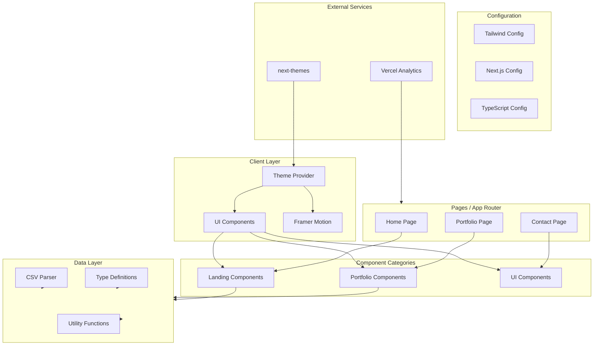
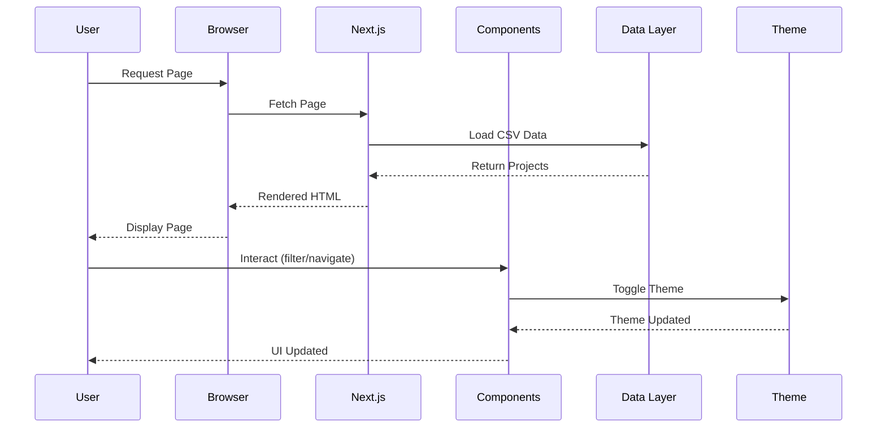

# Automatic - AI-First Development Agency Landing Page

> A modern, professional landing page template for development agencies and tech consultancies built with Next.js 14, TypeScript, and Tailwind CSS.

## Table of Contents

- [Features](#features)
- [System Architecture](#system-architecture)
- [Tech Stack](#tech-stack)
- [Quick Start](#quick-start)
- [Project Structure](#project-structure)
- [Configuration](#configuration)
- [Customization](#customization)
- [Deployment](#deployment)
- [Statistics](#statistics)
- [Support](#support)
- [License](#license)

---

## Features

### Core Features

- **Modern UI/UX**
  - Dark/light theme switching with seamless transitions
  - Bento grid layout for portfolio showcase
  - Smooth animations using Framer Motion
  - Glassmorphism effects and modern gradients

- **Responsive Design**
  - Mobile-first approach
  - Optimized for all screen sizes
  - Touch-friendly navigation
  - Adaptive typography

- **Portfolio System**
  - Dynamic filtering by category
  - Masonry grid layout
  - CSV-based data management
  - Support for external data sources

- **SEO & Performance**
  - Server-side rendering (SSR) ready
  - Automatic Open Graph meta tags
  - Vercel Analytics integration
  - Optimized images and assets

- **Contact & Inquiry**
  - Project inquiry form
  - Contact form with validation
  - Success/error state handling
  - Email integration ready

### Additional Features

- **Component Library**
  - 10+ reusable React components
  - Shadcn/ui inspired design system
  - Consistent design tokens
  - Accessible by default

- **Development Tools**
  - Hot module replacement (HMR)
  - ESLint with strict rules
  - TypeScript type checking
  - Tailwind CSS IntelliSense support

---

## System Architecture



### Architecture Flow



---

## Tech Stack

### Core Technologies

| Category | Technology | Version | Purpose |
|----------|------------|---------|---------|
| **Framework** | Next.js | 14.2.16 | React framework with App Router |
| **Language** | TypeScript | 5.x | Type-safe JavaScript |
| **Styling** | Tailwind CSS | 3.3+ | Utility-first CSS framework |
| **Runtime** | React | 18.x | UI library |
| **Animations** | Framer Motion | latest | Declarative animations |
| **Themes** | next-themes | latest | Dark/light mode switching |

### UI & Utilities

| Category | Technology | Purpose |
|----------|------------|---------|
| **Icons** | Lucide React | Icon library |
| **Class Merging** | clsx, tailwind-merge | Conditional classes |
| **Components** | CVA (Class Variance Authority) | Component variants |
| **Animation** | tailwindcss-animate | CSS animations |
| **Typography** | @tailwindcss/typography | Prose styling |

### Analytics & Integration

| Category | Technology | Purpose |
|----------|------------|---------|
| **Analytics** | Vercel Analytics | Performance tracking |
| **Build** | PostCSS | CSS processing |
| **Linting** | ESLint | Code quality |

---

## Quick Start

### Prerequisites

- Node.js 18.17 or later
- npm, yarn, pnpm, or bun

### Installation Steps

1. **Clone the repository**
   ```bash
   git clone <repository-url>
   cd ai-agency-landing-page-and-portfolio
   ```

2. **Install dependencies**
   ```bash
   npm install
   # or
   yarn install
   # or
   pnpm install
   # or
   bun install
   ```

3. **Start the development server**
   ```bash
   npm run dev
   # or
   yarn dev
   # or
   pnpm dev
   # or
   bun dev
   ```

4. **Open in browser**
   Navigate to [http://localhost:3000](http://localhost:3000)

---

## Project Structure

```
ai-agency-landing-page/
├── app/                          # Next.js App Router
│   ├── layout.tsx               # Root layout with providers
│   ├── page.tsx                # Home page
│   ├── globals.css             # Global styles
│   └── portfolio/
│       └── page.tsx            # Portfolio page
├── components/                  # React components
│   ├── landing-page/           # Landing page sections
│   │   ├── hero.tsx           # Hero section
│   │   ├── services.tsx        # Services section
│   │   ├── stats.tsx          # Statistics section
│   │   ├── portfolio.tsx      # Portfolio preview
│   │   ├── faq.tsx            # FAQ section
│   │   └── cta.tsx            # Call-to-action
│   ├── portfolio/             # Portfolio components
│   │   ├── portfolio-grid.tsx # Masonry grid
│   │   └── portfolio-card.tsx # Project card
│   └── ui/                     # Reusable UI components
│       ├── button.tsx         # Button variants
│       ├── card.tsx           # Card component
│       └── input.tsx         # Form inputs
├── public/                     # Static assets
│   ├── data/                  # Sample data
│   │   └── portfolio-sample.csv
│   └── images/               # Project images
├── utils/                      # Utility functions
│   └── csv-parser.ts         # CSV parsing
├── types/                      # TypeScript types
│   └── index.ts              # Type definitions
├── styles/                     # Additional styles
│   └── components/           # Component styles
├── tailwind.config.ts        # Tailwind configuration
├── next.config.mjs           # Next.js configuration
├── tsconfig.json             # TypeScript configuration
├── package.json             # Dependencies
└── README.md                 # This file
```

---

## Configuration

### Environment Variables

Create a `.env.local` file in the root directory:

```env
# Site Configuration
NEXT_PUBLIC_SITE_URL=https://yourdomain.com
NEXT_PUBLIC_SITE_NAME=Your Agency Name

# Analytics (optional)
VERCEL_ANALYTICS_ID=your_analytics_id

# Contact Form (optional)
CONTACT_EMAIL=your@email.com
```

### Tailwind Configuration

The `tailwind.config.ts` includes:

- **Custom Colors**: Primary, secondary, muted, accent, destructive, card, popover
- **Border Radius**: lg, md, sm variants
- **Grid Layouts**: bento-1, bento-2, auto-Dense
- **Typography Plugin**: Prose styling with custom colors
- **Dark Mode**: Class-based dark mode support

### TypeScript Configuration

Key compiler options:

| Option | Value | Purpose |
|--------|-------|---------|
| `strict` | true | Enable strict type checking |
| `esModuleInterop` | true | ES module interoperability |
| `jsx` | preserve | Keep JSX for Next.js |
| `paths` | @/* | Path aliases |
| `isolatedModules` | true | Safe module imports |

### Next.js Configuration

```javascript
{
  eslint: { ignoreDuringBuilds: true },
  typescript: { ignoreBuildErrors: true },
  images: { unoptimized: true }
}
```

---

## Customization

### Changing Site Information

1. **Site Metadata**
   - Edit `app/layout.tsx` for meta tags, title, and description

2. **Hero Section**
   - Modify `components/landing-page/hero.tsx`
   - Update headline, subheadline, and CTAs

3. **Services**
   - Edit `components/landing-page/services.tsx`
   - Add/modify service cards

4. **FAQ Content**
   - Update `components/landing-page/faq.tsx`
   - Add new Q&A pairs

### Styling & Colors

1. **Primary Brand Color**
   - Search and replace `#7A7FEE` across the project
   - Or update Tailwind theme colors

2. **Theme Colors**
   - Edit `components/landing-page/styles.css`
   - Tailwind config: `tailwind.config.ts`

3. **Dark/Light Mode**
   - Uses `next-themes` for automatic switching
   - Configure in `app/providers.tsx`

### Portfolio Data

#### Option 1: Edit CSV File (Recommended)

1. Open `public/data/portfolio-sample.csv`
2. Update project data following the columns:
   - `Slug`: URL-friendly identifier
   - `Title`: Project name
   - `Logo`: Path to logo image
   - `Main Image`: Path to main image
   - `Short Description`: Brief description
   - `Project URL`: Live project link (optional)
   - `Content`: Detailed HTML content
   - `Sort Order`: Sorting date (YYYY-MM-DD)

#### Option 2: External CSV

1. Host CSV on Vercel Blob, AWS S3, or Google Sheets
2. Update fetch URL in `utils/csv-parser.ts`

#### Option 3: JSON Data

1. Modify `utils/csv-parser.ts` to fetch JSON
2. Create JSON structure matching TypeScript types

#### Option 4: CMS Integration

Consider these headless CMS options:
- **Contentful** - Enterprise content platform
- **Strapi** - Open-source headless CMS
- **Sanity** - Real-time content platform
- **Ghost** - Professional publishing platform

### Images

1. **Project Images**
   - Add to `public/images/` directory
   - Reference in CSV or data source

2. **Logos & Icons**
   - Replace files in `public/` directory
   - Update favicon: `public/favicon.ico`

---

## Deployment

### Deploy to Vercel (Recommended)

1. **Push to GitHub**
   ```bash
   git init
   git add .
   git commit -m "Initial commit"
   git remote add origin <your-repo-url>
   git push -u origin main
   ```

2. **Connect to Vercel**
   - Log in to [vercel.com](https://vercel.com)
   - Import your GitHub repository
   - Deploy with default settings

3. **Environment Variables**
   - Add variables in Vercel dashboard
   - Reference `.env.example`

### Deploy to Other Platforms

| Platform | Method |
|----------|--------|
| **Netlify** | Connect Git repo or CLI |
| **Railway** | Git deploy or Dockerfile |
| **DigitalOcean** | App Platform |
| **AWS Amplify** | Git integration |
| **Docker** | Container deployment |

### Build for Production

```bash
npm run build
npm start
```

---

## Statistics

### Bundle Size

| Asset | Size | Description |
|-------|------|-------------|
| **Initial JS** | ~150KB | Main JavaScript bundle |
| **CSS** | ~20KB | Tailwind styles |
| **Fonts** | Variable | System fonts used |

### Performance Targets

- **Lighthouse Score**: 90+ on all metrics
- **First Contentful Paint**: < 1.5s
- **Largest Contentful Paint**: < 2.5s
- **Cumulative Layout Shift**: < 0.1
- **Time to Interactive**: < 3s

### Component Count

| Category | Count |
|----------|-------|
| Landing Components | 8+ |
| Portfolio Components | 4+ |
| UI Components | 10+ |
| Total Components | 20+ |

### Sample Data

The template includes 6 sample projects:
1. **TaskFlow Pro** - AI-powered task management
2. **ShopConnect** - Multi-vendor marketplace
3. **ContentAI Studio** - AI content creation
4. **WealthTracker** - Personal finance dashboard
5. **MedConnect** - Telemedicine platform
6. **CryptoInsights** - Blockchain analytics

---

## Support

### Getting Help

1. **Documentation** - Review this README
2. **Code Comments** - Check inline documentation
3. **GitHub Issues** - Report bugs or request features
4. **Contact** - Email support team

### Contributing

1. Fork the repository
2. Create a feature branch
3. Make your changes
4. Submit a pull request

---

## License

This project is available under the **MIT License**.

You are free to:
- Use this template for personal or commercial projects
- Modify and customize for your needs
- Redistribute with attribution

See the `LICENSE` file for full details.

---

> Built with Next.js 14, TypeScript, and Tailwind CSS